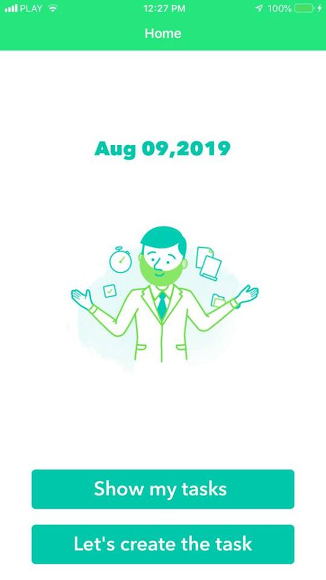
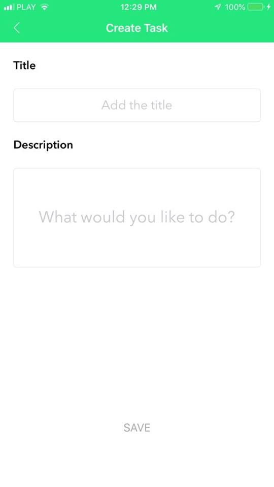
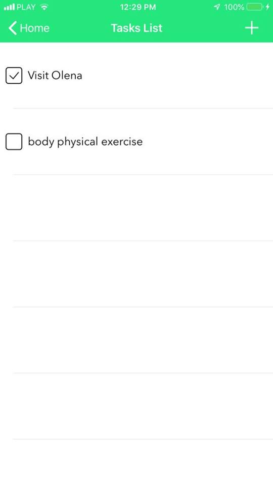
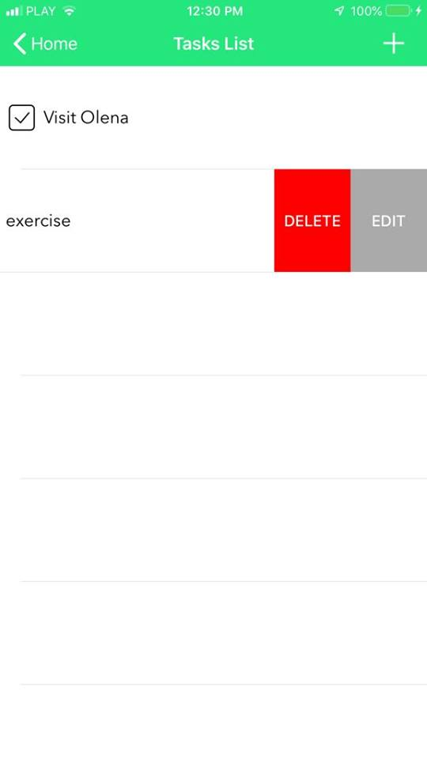
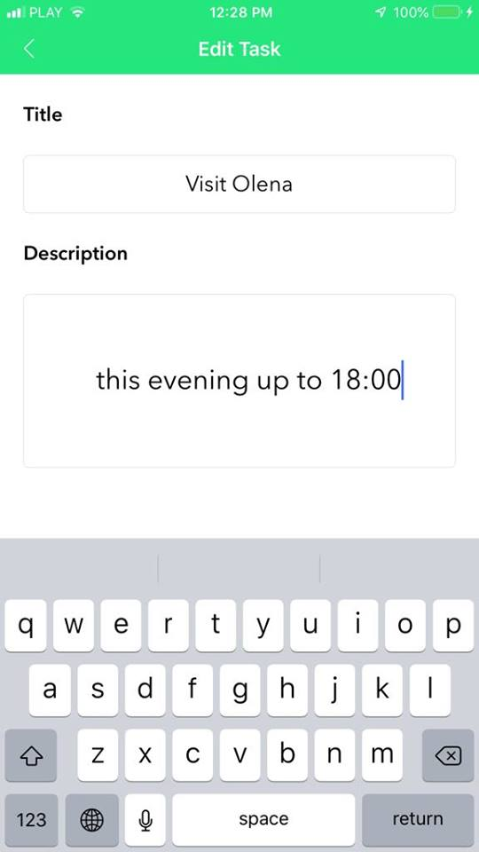
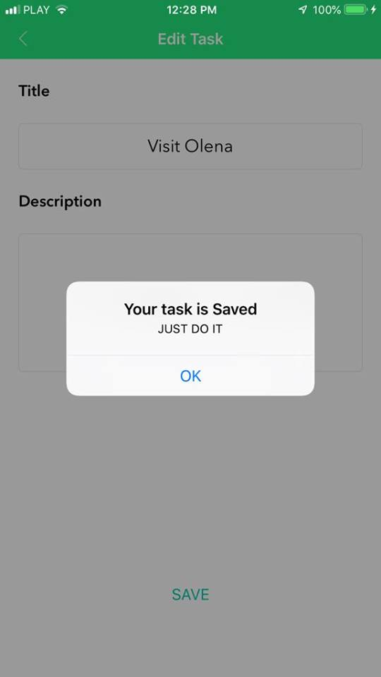

# GuruDoes

iOS demo app utilizing Core Data to track tasks

Made for NetGuru enterence iOS workshops in Łódź on 24-25th August. 
You can create tasks, mark it as done, edit or delete .

 &nbsp; &nbsp; &nbsp; &nbsp; &nbsp; &nbsp;

 &nbsp; &nbsp; &nbsp; &nbsp; &nbsp; &nbsp; 

